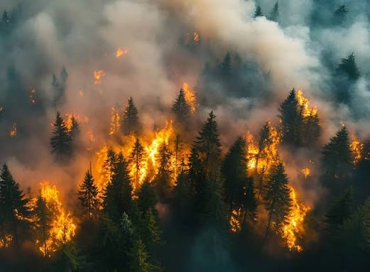
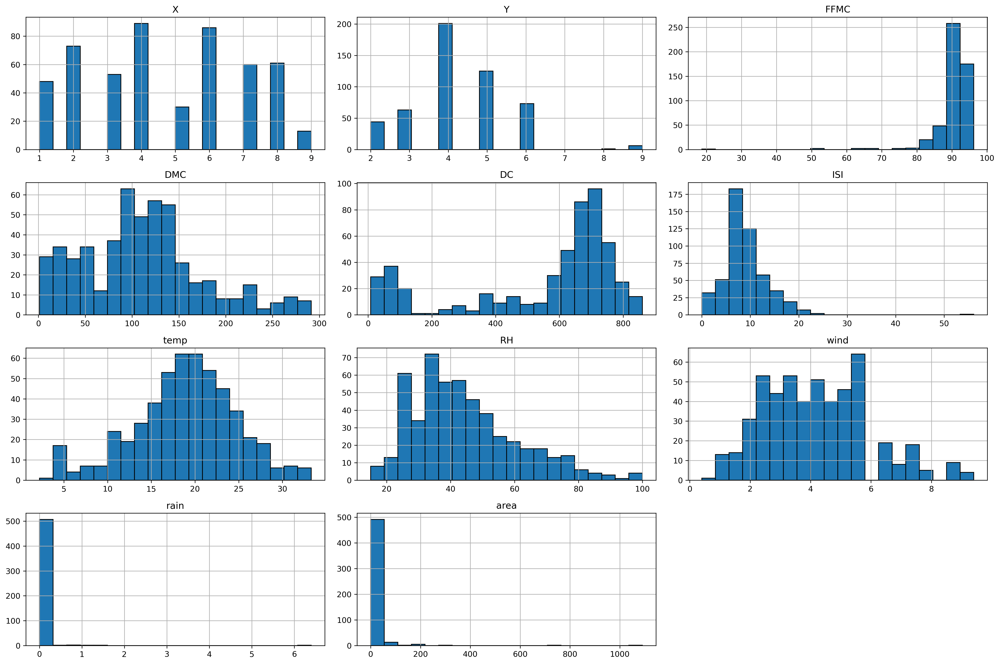
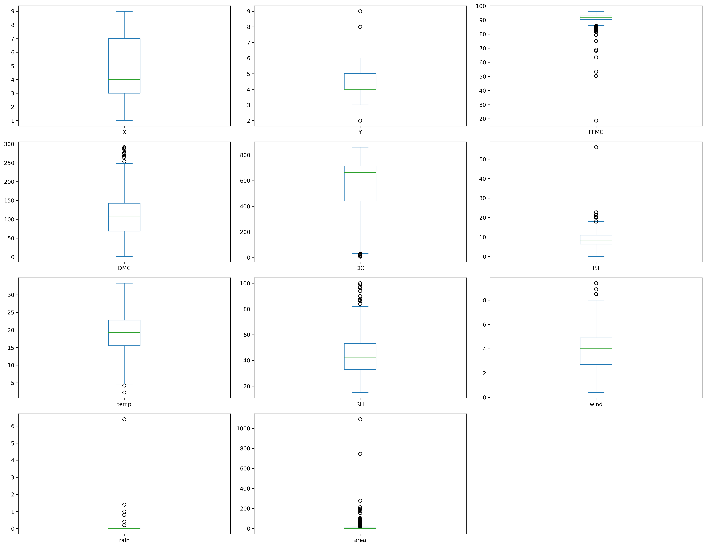
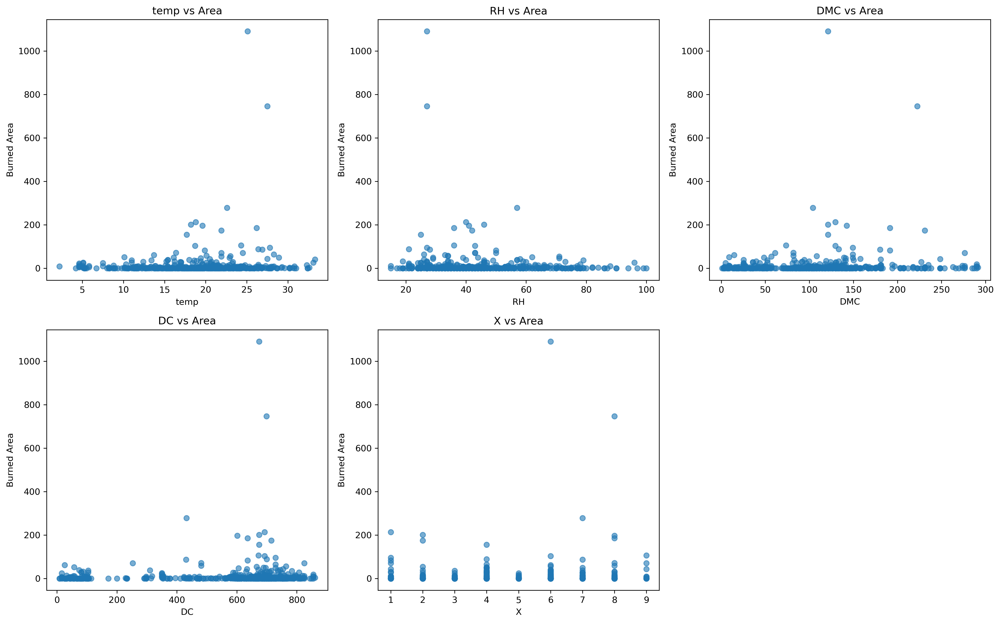
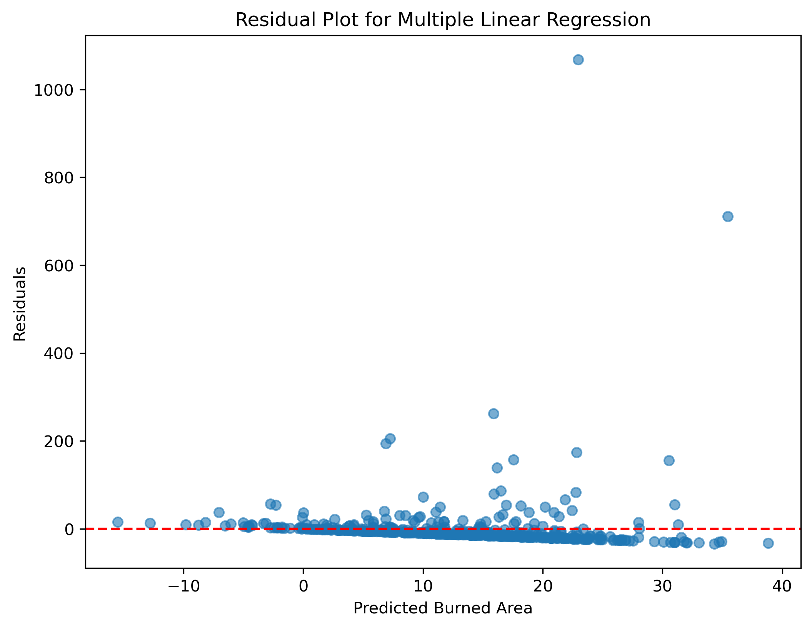

# 🌲 Forest Fires Analysis



An end-to-end data science project exploring the environmental factors that influence wildfire size and severity using exploratory data analysis, statistical modeling, and machine learning.
---

## 📖 Project Overview

Wildfires pose significant environmental, economic, and public safety challenges. Understanding the conditions that contribute to wildfire behavior can support better prevention strategies and resource allocation.

In this project, I analyzed the Forest Fires dataset from the UCI Machine Learning Repository to investigate the environmental factors associated with burned area. The project follows a complete data science workflow, including data cleaning, exploratory data analysis, feature engineering, predictive modeling, statistical diagnostics, and model evaluation.

---

## 🚀 Project Highlights

- Cleaned and validated a real-world wildfire dataset.
- Removed duplicate observations to improve data quality.
- Performed comprehensive Exploratory Data Analysis (EDA).
- Investigated feature relationships using statistical visualizations.
- Built and compared multiple regression models.
- Applied Ridge and Lasso Regression for model regularization.
- Developed a Logistic Regression model for wildfire risk classification.
- Evaluated model performance using statistical diagnostics and machine learning metrics.
- Generated recommendations based on analytical findings.

---

## 🎯 Business Problem

Wildfires can cause extensive damage to ecosystems, infrastructure, and communities. Predicting wildfire severity remains challenging because it depends on multiple environmental factors.

The goal of this project was to determine which variables most influence burned area and evaluate whether statistical and machine learning models can effectively predict wildfire behavior.

---

## 🎯 Project Objectives

- Analyze the environmental factors associated with wildfire size.
- Identify relationships between weather conditions and burned area.
- Develop predictive regression and classification models.
- Compare model performance using multiple evaluation metrics.
- Provide recommendations for improving wildfire prediction.

---

## 📂 Dataset

**Dataset:** Forest Fires

**Source:** UCI Machine Learning Repository

**Original Observations:** 517

**Final Observations:** 513 (after removing duplicate records)

**Target Variable:** Burned Area (`area`)

### Features Included

- Spatial Coordinates (X, Y)
- Fire Weather Index (FFMC, DMC, DC, ISI)
- Weather Variables
  - Temperature
  - Relative Humidity
  - Wind
  - Rain
- Calendar Variables
  - Month
  - Day

---

## 🛠 Tech Stack

### Programming

- Python

### Libraries

- Pandas
- NumPy
- Matplotlib
- SciPy
- Scikit-learn
- Statsmodels

### Development Tools

- Jupyter Notebook
- Git
- GitHub

---

## 🔄 Project Workflow

```text
Data Collection
        ↓
Data Cleaning
        ↓
Exploratory Data Analysis
        ↓
Feature Engineering
        ↓
Model Development
        ↓
Model Evaluation
        ↓
Business Recommendations
```

---

## 🔍 Methodology

The project followed an end-to-end analytical workflow:

- Data inspection and cleaning
- Duplicate record removal
- Exploratory Data Analysis (EDA)
- Feature selection and engineering
- Multiple Linear Regression
- Nonlinear Regression
- Interaction Models
- Indicator Variable Models
- Log Transformation
- Ridge Regression
- Lasso Regression
- Logistic Regression
- Model diagnostics and evaluation

---

# 📊 Exploratory Data Analysis

## Feature Distributions



Histograms were used to examine the distribution of numerical variables, identify skewness, and understand the overall characteristics of each feature before model development.

---

## Outlier Analysis



Boxplots were used to identify outliers and assess the spread of the variables. Significant outliers were observed in the burned area target variable and several predictor variables.

---

## Relationship Analysis



Scatter plots were used to explore relationships between environmental variables and burned area. While some variables showed weak positive associations, substantial variability suggested that wildfire behavior is influenced by multiple interacting factors.

---

## Model Diagnostics



Residual analysis was performed to assess model assumptions, evaluate prediction errors, and identify potential heteroscedasticity and influential observations.

---

## Models Implemented

### Regression Models

- Multiple Linear Regression
- Nonlinear Regression
- Interaction Model
- Indicator Variable Model
- Log-Transformed Regression
- Ridge Regression
- Lasso Regression

### Classification Model

- Logistic Regression

---

## 📈 Model Evaluation

Regression models were evaluated using:

- R²
- Adjusted R²
- Mean Squared Error (MSE)
- F-statistic
- AIC
- BIC

Classification performance was evaluated using:

- Accuracy
- Precision
- Recall
- F1-score
- Confusion Matrix

Model assumptions were assessed using:

- Residual Analysis
- Q-Q Plots
- Cook's Distance
- Variance Inflation Factor (VIF)

---

## 🔍 Key Findings

- The burned area variable exhibited a highly right-skewed distribution with numerous extreme values.
- Temperature and drought-related variables showed stronger relationships with burned area than rainfall.
- Multiple regression models explained only a limited proportion of the variation in wildfire size.
- Ridge and Lasso Regression produced results similar to the baseline regression model, indicating limited multicollinearity.
- Logistic Regression achieved modest predictive performance, suggesting that additional environmental variables would improve wildfire prediction.
- Statistical diagnostics highlighted the importance of transformation and assumption checking during model development.

---

## 💡 Business Recommendations

- Incorporate additional variables such as vegetation type, topography, and human activity to improve predictive performance.
- Explore ensemble machine learning models such as Random Forest and XGBoost.
- Continue monitoring environmental indicators to support wildfire risk assessment.
- Use predictive analytics alongside expert judgment rather than as a standalone decision-making tool.

---

## 📁 Repository Structure

forest-fires-analysis/
│
├── images/                           # Project visualizations used throughout the README
│   ├── distributions.png             
│   ├── boxplots.png                  
│   ├── scatterplots.png             
│   ├── residual_plot.png                            
│
├── C06M08Lab.ipynb                   # Complete data analysis and machine learning workflow
├── Forest_Fires_Final_Report.pdf     # Final project report and findings
├── README.md                         # Project documentation and overview
├── requirements.txt                  # Python dependencies required to run the project
└── LICENSE                           # MIT License governing the use of this repository

---

## 🚀 Installation

```bash
git clone https://github.com/Fascos/forest-fires-analysis.git

cd forest-fires-analysis

pip install -r requirements.txt
```

---

## ▶️ Running the Project

1. Clone the repository.
2. Install the required dependencies.
3. Open the Jupyter Notebook.
4. Run the notebook from top to bottom.

---

## 🔮 Future Improvements

- Explore tree-based ensemble models such as Random Forest and XGBoost.
- Incorporate additional environmental variables.
- Deploy the model as an interactive Streamlit application.
- Automate the data preprocessing workflow.
- Investigate deep learning approaches for wildfire prediction.

---

## 👤 Author

**Fascos Jepleting**

Health Informatics Graduate | Data Science & Machine Learning

📧 fascosjepleting@gmail.com

🔗 LinkedIn: https://www.linkedin.com/in/fascos-jepleting/

---